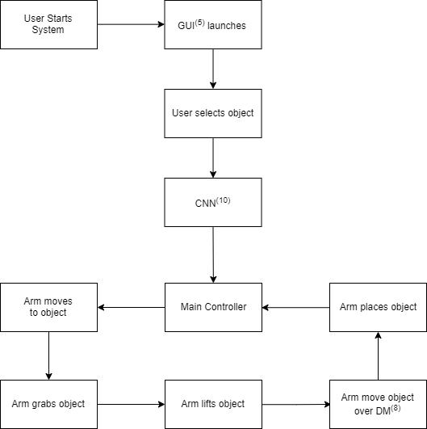
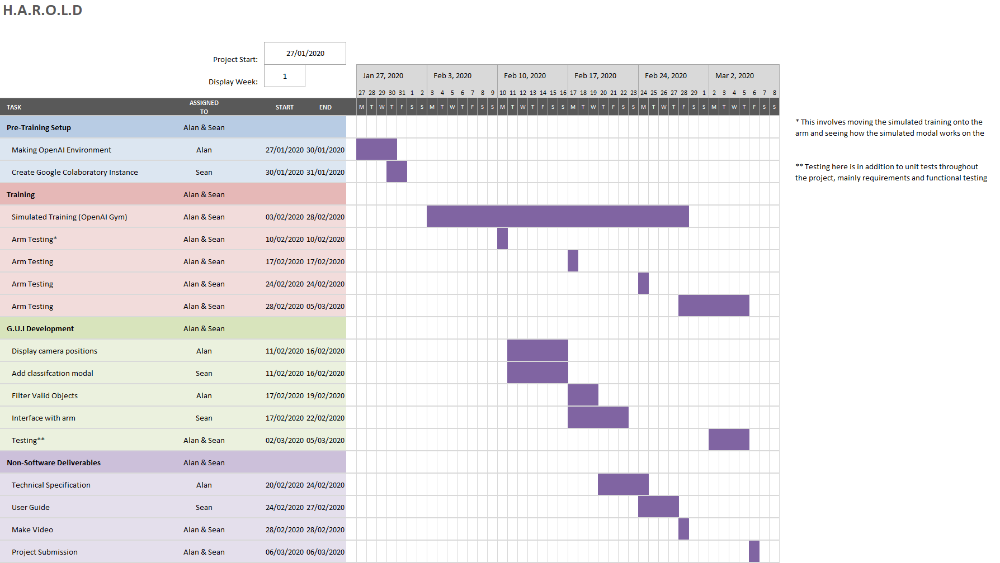

# Table of contents
1. Introduction
    1 Overview
    2 Business Context
    3 Glossary
2. General Description
    1 Product / System Functions
    2 User Characteristics and Objectives
    3 Operational Scenarios
    4 Constraints
3. Functional Requirements
4. System Architecture
5. High-Level Design
6. Preliminary Schedule
7. Appendices

## 1. Introduction

### 1.1 Overview
H.A.R.O.L.D is a robotic arm which will be trained using a combination of *Reinforcement Learning*(1), *H.E.R*(2), and *D.D.P.G*(3), which allows us to create a functional and accurate robotic arm, which does not require a *P.I.D Controller*(4) to move smoothly. The aim of this project is to train H.A.R.O.L.D to be able to grab, lift and reposition a given object to a specified location.

We will be using 2 HIMAX cameras, one mounted externally and on mounted on the arm, in order to give H.A.R.O.L.D greater positional awareness as well as being able to locate the object it wants to pick up in relation to itself.

Given enough time, we also plan to implement a *GUI*(5) which allows the user to select an object, which will be classified by a pre-trained network, for H.A.R.O.L.D to pick up and reposition.

### 1.2 Business Context

Robotics play a huge role in the manufacturing industry which allows much of the manual labor to be automated, current implementations are inflexible as they require static environments, and if something is off, the system cannot account for it and fails. 

Current 

By making use of *machine learning*(6) and *neural networks*(7), we can both remove the aforementioned need for specialized training and the strict rules which current implementations must abide by.

### 1.3 Glossary

1. Reinforcement Learning
   - The training of machine learning models to make a sequence of decisions. The agent learns to achieve a goal in an uncertain, potentially complex environment.[[deepsense]](https://deepsense.ai/what-is-reinforcement-learning-the-complete-guide/)
2. H.E.R (Hindsight Experience Replay)
   - A method of simulating artificial data by "pretending" that the goal was different to the goal when training was actually running.[[arXiv:1707.01495]](https://arxiv.org/pdf/1707.01495.pdf)[cs.LG]
3. D.D.P.G (Deep Deterministic Policy Gradient)
   - [[arXiv:1509.02971]](https://arxiv.org/abs/1509.02971)[cs.LG]
4. P.I.D Controller
   - An instrument used in industrial control applications to regulate temperature, flow, pressure, speed and other process variables. PID (proportional integral derivative) controllers use a control loop feedback mechanism to control process variables and are the most accurate and stable controller.
5. G.U.I (Graphical User Interface)
   - A visual menu which the user utilises to interact with the program or hardware
6. Machine Learning
   - The scientific study of algorithms and statistical models that computer systems use to preform a specific task without explicit instructions.
7. Neural Network
   - A collection of nodes connected by synapses which receive and process signals to complete a task.
8. DM (Data Matrix)
   -  A 2 Dimensional code consisting of black and white cells arranged in a square or rectangle pattern[[wikipedia]](https://en.wikipedia.org/wiki/Data_Matrix)
9. Classifier
   - A network which predicts the class of given data points[[towardsdatascience]](https://towardsdatascience.com/machine-learning-classifiers-a5cc4e1b0623)

## 2. General Description

### 2.1 Product/ System Functions

Here is a preliminary list of functions we would are looking to implement.

* Object Detection.
* Ability to pickup generic objects.
* Move a generic object to a predefined area.
* Collision Avoidance.

### 2.2 User Characteristics and Objectives

Our goal is to make our arm accessible to as many users as possible. This includes users with limited technical/ robotics experience. Basic knowledge of how to operate a GUI and common sense around machinery should be enough.

Time permitting we would like to implement an easy to use scripting interface. This would allow our users to easily develop rudimentary events that could take place in a manufacturing environment.

### 2.3 Operational Scenarios

* **Select Object**
The user will be shown both cameras views through the GUI with bound boxes around each recognized object. The user will then be able to select this object by left clicking on the bound box, which will in tern instruct HAROLD to pickup the selected object.

### 2.4 Constraints

There are several constraints that will effect this project both physical and software related.

* **Strength of Servos.**
There is a good chance that our arm's servos will be weaker than we would like. Because of this we will need to implement some form of weight limitation. This will be subject to testing.

* **Reach**
There is a limit to how far the arm will be able to pickup objects, this is based on the physical dimensions of the arm, and the rail at the base for lateral movement.

* **Time**
As this project is based on Reinforcement Learning, the longer we train the models, the better the arm will operate. We're hoping to overcome this by making use of H.E.R (as explained above), this has had proven effects on the efficiency of training Reinforced models.

* **Lighting Conditions**
The Lighting of a particular scene could have an effect on object recognition. If this proves to be an issue we may need to add led's to the chaise of the arm.

## 3. Functional Requirements

### 3.1 Arm moves towards object

##### Description

The robot arm must be able to move towards the object to pick up, such that the clamp can grasp said object.

##### Criticality

This is an essential step in picking up an object, since if the object is out of range it cannot be held by the clamp.

##### Technical issues

The main issue is whether we can get the network to train sufficiently so that it can move to the object accurately and consistently.

##### Dependencies on other requirements

This depends on the *classifier* being able to recognise the object and create a bounding box around it.

### 3.2 Clamp grasps object

##### Description

The clamp mounted on the arm will close such that it grasps any object which is positioned between the clamp.

##### Criticality

It is important for the clamp to be able to grasp the object firmly so as not to drop it while trying to reposition it

##### Technical issues

It's important issue for us to consider the weight of the object in relation to the strength of the servos controlling the arm, as it will not be able to lift the object if it can't grasp it firmly enough.

##### Dependencies on other requirements

This stage depends heavily on the arm moving to the object, since the object cannot be held if it's not in range of the arm.

### 3.3 Moving the object to a designated space

##### Description

Once the object is held, the arm will lift it, and move the object to an area with a *DM*(8) printed onto a page, designating where the object will be placed.

##### Criticality

In order for this arm to be used in an industrial setting, it must be able to consistently and accurately move objects to their desired location.

##### Technical issues

Again, it's important for us to make sure the object being moved is not too heavy for the servos to be able to lift and move.

##### Dependencies of other requirements

This step is dependent on both the arm being able to grasp the object well, and also on the *classifier*(9) being able to detect and locate the *DM* consistently.

### 3.4 Classifier

##### Description

A *Neural Network* able to recognise and label an object, allowing the arm to locate specific objects and locations.

##### Criticality

This is a very important part of the project as the arm will not be able to detect any objects without it.  Since this is such an important part which requires a lot of training and a large dataset to develop, we have decided to use a pre-trained network.

##### Technical issues

Most *CCN*s(10) are dependent on lighting conditions, but since it won't be our own network, we wont know the limitations without first select and then test it.

## 4. System Architecture

If we have enough time to develop the GUI(5), the System architecture will look more like this

## 5. High-Level Design

#### 5.1 Initialisation

The user connects to the main controller on the arm, which launches the GUI(5), allowing the user to start the arm.

#### 5.2 User Selects Object

The user selects the object and the arm starts.

#### 5.3 Arm moves object

The arm will move to, pick up and relocate the object that was selected by the user on startup.

#### 5.4 Arm returns to rest position

The arm has now placed the object on the DM(8) and returns to it's initial position.

## 6. Preliminary Schedule

Below is our Preliminary Schedule represented by a Gantt chart.

